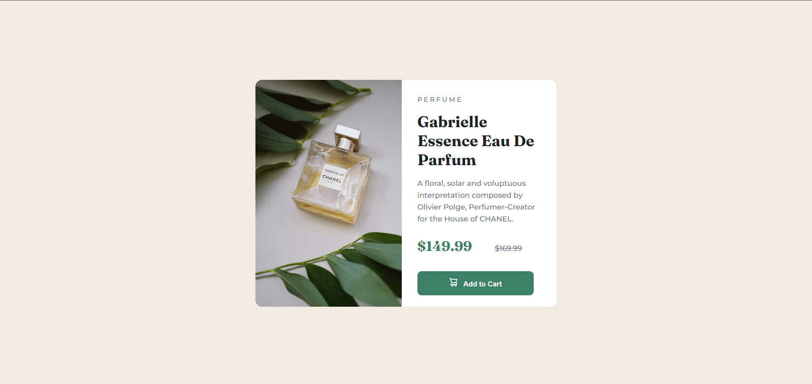
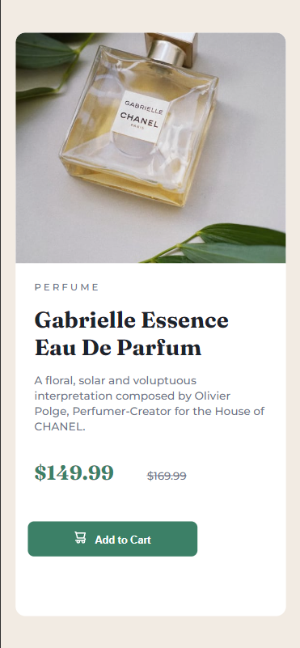

# Frontend Mentor - Product preview card component solution

This is a solution to the [Product preview card component challenge on Frontend Mentor](https://www.frontendmentor.io/challenges/product-preview-card-component-GO7UmttRfa). Frontend Mentor challenges help you improve your coding skills by building realistic projects. 

## Table of contents

- [Overview](#overview)
  - [The challenge](#the-challenge)
  - [Screenshots](#screenshots)
  - [Links](#links)
- [My process](#my-process)
  - [Built with](#built-with)
  - [What I learned](#what-i-learned)
  - [Continued development](#continued-development)
  - [Useful resources](#useful-resources)
- [Author](#author)
- [Acknowledgments](#acknowledgments)

## Overview

### The challenge

Users should be able to:

- View the optimal layout depending on their device's screen size
- See hover and focus states for interactive elements

## Screenshots
### Desktop view

### Mobile view

### Links

- Solution URL: [(https://github.com/DDeepanshu99/product-preview-card-solution)]
- Live Site URL: [(https://ddeepanshu99.github.io/product-preview-card-solution)]

## My process

### Built with

- Semantic HTML5 markup
- CSS custom properties
- Flexbox

### What I learned

This was quite challenging for me. I could not figure out how to transition from desktop to mobile in flexbox. I am not quite comfortable with grid yet so I had to use flexbox. The mobile design was really hard to perfect. My friend raghav also helped me in the mobile design. Eventually I had to take help of chatgpt and I did learnt quite new stuff.

### Continued development

I will be learnign more about responsive designs and css grid layout.

### Useful resources

- [w3schools](https://www.w3schools.com/css/default.asp) - This is an amazing resource to learn css. I went through this a lot.
- [MDN Web Docs](https://developer.mozilla.org/en-US/) - Another amazing resource to learn pretty much everything relaated to html, css and js. I also used this as my resource.
- [ChatGpt](https://chat.openai.com/) - Chatgpt also helped me a lot.

## Author

- GitHub - [DDeepanshu99](https://github.com/DDeepanshu99)
- Frontend Mentor - [DDeepanshu99](https://www.frontendmentor.io/profile/DDeepanshu99)

## Acknowledgments

Raghav Gulati helped me a lot in my responsive layout. Checkout his frontend mentor profile [Rgulati4657](https://www.frontendmentor.io/profile/Rgulati4657).

Checkout Kevin Powell's video on responsive web design [A practical guide to responsive web design](https://youtu.be/x4u1yp3Msao?feature=shared). 
